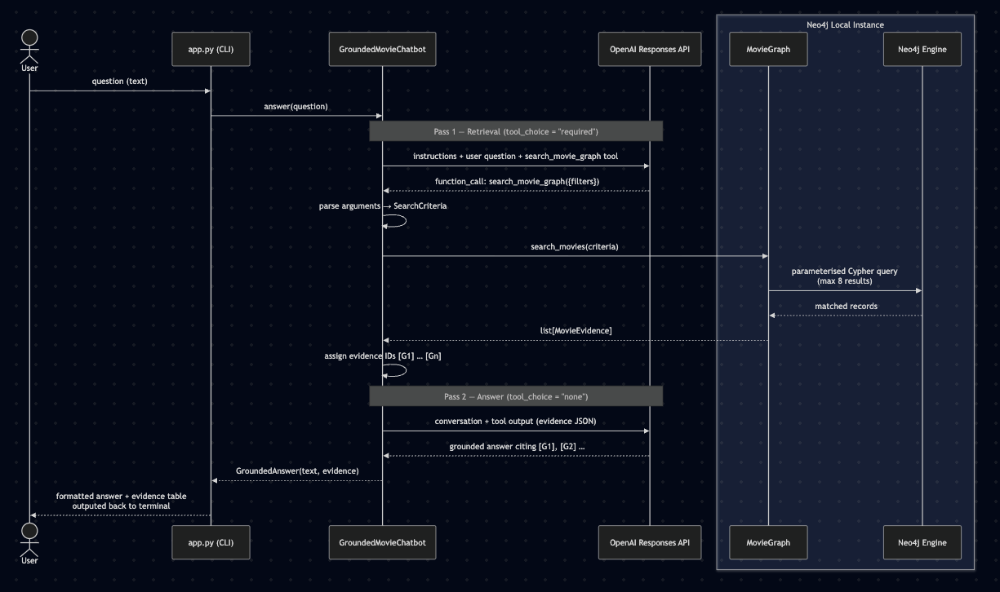

# Project 1 — Basic Neo4j (local) & OpenAI Responses API Graph-Grounded Chatbot


A basic graph database (Neo4j local instance) centric script showcasing the foundational GraphRAG pattern:
**retrieve explicit graph facts before asking an LLM to answer**.

It's a GraphRAG movie assistant — an LLM chatbot (utilising the `OpenAI responses api with function calling`) that is strictly grounded in facts retrieved from a Neo4j knowledge graph. Instead of letting the LLM hallucinate movie facts from its training data, every answer must be backed by evidence fetched from the graph database, with citations like [G1], [G2], etc.

## Architecture Overview

| File         | Role                                                                                                                                               |
| ------------ | -------------------------------------------------------------------------------------------------------------------------------------------------- |
| `config.py`  | Loads `NEO4J_*` and `OPENAI_API_KEY` from `.env`; defaults model to `gpt-5.6-luna`                                                                 |
| `graph.py`   | Neo4j access layer — defines the Cypher query, `SearchCriteria`, `MovieEvidence`, schema constraints, and seeding logic                            |
| `chatbot.py` | Two-pass OpenAI Responses API loop — first call extracts structured filters via tool-calling, second call answers only from the retrieved evidence |
| `seed.py`    | Idempotent seeder — loads `data/movies.json` into Neo4j only if the DB is empty                                                                    |
| `app.py`     | CLI entry point — supports `--question`, `--show-context`, `--check`, or an interactive REPL                                                       |



The above sequence diagram illustrates the end-to-end request flow of the GraphRAG movie assistant where the user's question enters via app.py, triggers a two-pass OpenAI tool-calling loop (Pass 1 forces a search_movie_graph call that runs a parameterised Cypher query against the Neo4j local instance; Pass 2 generates a grounded answer citing only the retrieved evidence IDs), and returns a formatted response with an evidence table to the terminal

## Simplicity

This example intentionally does not use embeddings or vector search.

Its job is to establish the baseline knowledge graph, retrieval boundary, tool-calling
loop, citations, and refusal behavior.

## What it demonstrates

- A semantic graph model with directional relationships.
- One long-lived Neo4j Python driver per application.
- Parameterized Cypher 25 and bounded scalar results.
- OpenAI Responses API function calling with `gpt-5.6-luna`.
- A strict grounding contract: the final answer may use only retrieved facts.
- Inspectable evidence IDs such as `[G1]` in the answer and CLI output.

## Key Design Decisions

- No `embeddings`/`vector search` — this is intentionally the "baseline" GraphRAG pattern using only literal Cypher filters; This intentional limitation results in the inability of the Assistant to handle semantic/paraphrased queries (e.g. "films about dream-sharing"), etc
- Strict grounding contract — the LLM is instructed to never fill gaps from training knowledge; if no evidence is found, it must say so
- Two-pass tool loop:
  - the first LLM call (tool_choice="required") forces a `search_movie_graph` call;
  - the second (`tool_choice="none"`) generates the answer
- Bounded results — max 8 movies, max 8 cast per movie, overview truncated to 600 chars
- Idempotent seed — won't duplicate data if Movie nodes already exist

## Grounding and limitations

1. The LLM must call the graph search tool before answering. The tool returns a
   maximum of eight movies and projects only named scalar fields; it never sends
   raw Neo4j nodes to the model. If no evidence is returned, the answer must say
   the graph lacks enough information.

2. This is the baseline RAG pattern — we’re using only literal Cypher filters,
   not vector search, embeddings, or hybrid retrieval. The model can’t “guess”
   intent (e.g. infer “dream-sharing films” from the text); it only matches the
   structured filters produced by the first pass.

3. The included ratings and vote counts are fixed demo snapshot values, not a
   live ratings feed.

## Knowledge graph schema

```text
(:Person)-[:DIRECTED]->(:Movie)-[:IN_GENRE]->(:Genre)
(:Person)-[:ACTED_IN {billingOrder}]->(:Movie)
```

`Movie.movieId`, `Person.name`, and `Genre.name` are unique MERGE keys. The
included seed is idempotent and runs only when the database has no `Movie`
nodes, so it will not duplicate an existing catalog.

The model supports at least these questions:

1. Which movies feature a particular actor?
2. Which movies were directed by a particular director?
3. Which highly rated movies belong to a requested genre?
4. What are the cast, director, genres, and plot of a title?
5. Which films connect a person to a genre?
6. Which matching films fall inside a release-year range?

## Request flow

```text
1. User's question
2. Model extracts typed graph filters
3. Search_movie_graph executes one bounded Cypher query
4. Neo4j returns Movie + Person + Genre evidence
5. Model answers only from that evidence and cites [G#]
```

## Run it

From the repository root:

```bash
# Safe on the current database: it skips seeding when Movie nodes already exist.
uv run python 1-Basic-Graph-Grounded-Chatbot/seed.py

# Verify .env and Neo4j without making an OpenAI request.
uv run python 1-Basic-Graph-Grounded-Chatbot/app.py --check

# Ask one question and expose the exact graph context used by the model.
uv run python 1-Basic-Graph-Grounded-Chatbot/app.py \
  --question "Which Christopher Nolan movies are rated at least 8.5?" \
  --show-context

# Or start the interactive CLI.
uv run python 1-Basic-Graph-Grounded-Chatbot/app.py --show-context
```

## Expected output

```bash
Assistant
Christopher Nolan movies rated at least 8.5:

- **The Dark Knight** — 9.0 [G1]
- **Inception** — 8.8 [G2]
- **Interstellar** — 8.6 [G3]
- **The Prestige** — 8.5 [G4]

Retrieved graph evidence
[G1] The Dark Knight (2008) — rating 9.0
     directors: Christopher Nolan
     cast: Christian Bale, Heath Ledger, Aaron Eckhart, Michael Caine
     genres: Action, Crime, Drama
[G2] Inception (2010) — rating 8.8
     directors: Christopher Nolan
     cast: Leonardo DiCaprio, Joseph Gordon-Levitt, Elliot Page, Ken Watanabe
     genres: Action, Adventure, Sci-Fi
[G3] Interstellar (2014) — rating 8.6
     directors: Christopher Nolan
     cast: Matthew McConaughey, Anne Hathaway, Jessica Chastain, Mackenzie Foy
     genres: Adventure, Drama, Sci-Fi
[G4] The Prestige (2006) — rating 8.5
     directors: Christopher Nolan
     cast: Christian Bale, Hugh Jackman, Scarlett Johansson, Michael Caine
     genres: Drama, Mystery, Sci-Fi
```

Other useful prompts:

- `What connects Keanu Reeves to science-fiction movies?`
- `Recommend highly rated drama films released after 2010.`
- `Who directed Arrival, and which actors are in it?`

## Test it

The unit tests use fakes, so they do not contact Neo4j or OpenAI:

```bash
uv run python -m unittest discover \
  -s 1-Basic-Graph-Grounded-Chatbot/tests -v
```
