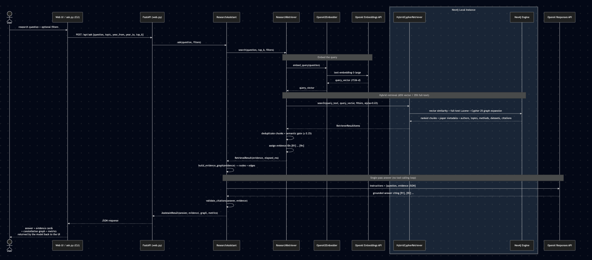

# Project 2 — Hybrid GraphRAG Research Assistant


An evidence-first Local `Neo4j` & `OpenAI Responses API (no tool-calling loop) and text embedding model` Research Workbench that combines: `semantic vector search`, `lexical full-text search`, `knowledge-graph traversal` in Neo4j — using the graph database as the central store that connects papers, authors, methods, datasets, and citations into `a single navigable knowledge graph`, with a `strict grounding boundary` that constrains the `LLM` to answer only from retrieved evidence.

The assistant
finds relevant paper excerpts, expands each result into authors, topics,
methods, datasets, and citation neighbors, and then asks model to write
an answer using only that bounded evidence.

## How Project 2 builds upon Project 1

| Capability        | Project 1                           | Project 2                                       |
| ----------------- | ----------------------------------- | ----------------------------------------------- |
| Domain            | Structured movie facts              | Semi-structured AI research literature          |
| Retrieval         | LLM-generated literal graph filters | Hybrid 65% vector / 35% full-text ranking       |
| Context           | One bounded movie subgraph          | Retrieved chunks plus graph-neighbor expansion  |
| Recall            | Exact entities and typed filters    | Paraphrases, concepts, titles, and keywords     |
| Relevance control | Query bounds                        | Hybrid rank + minimum semantic threshold        |
| Grounding         | `[G#]` graph records                | `[R#]` excerpt-level citations and source URLs  |
| Evaluation        | Unit-tested interaction             | Retrieval hit rate, MRR, and negative rejection |
| Interface         | Terminal chatbot                    | Responsive evidence workbench UI and CLI        |

Project 1 established the retrieval boundary.

Project 2 makes that boundary semantic and inspectable:

- vector similarity improves recall;
- lexical scoring preserves exact terminology;
- the graph explains why each excerpt belongs in the answer context.

## Request flow

```text
Question + optional topic/year filters
    -> OpenAI query embedding
    -> Neo4j vector candidates + full-text candidates
    -> linear hybrid rank (65% vector / 35% lexical)
    -> minimum semantic relevance gate
    -> graph expansion around each ResearchChunk
    -> bounded [R#] evidence package
    -> gpt-5.6-luna grounded synthesis
    -> answer + source ledger + evidence constellation + metrics
```

The no-evidence path is deterministic and does not call the answer model.
Generated answers are rejected if they omit citations or cite an ID that was
not retrieved.

## Knowledge graph

```text
(:ResearchAuthor)-[:AUTHORED]->(:ResearchPaper)
(:ResearchPaper)-[:HAS_CHUNK]->(:ResearchChunk {embedding})
(:ResearchPaper)-[:ABOUT]->(:ResearchTopic)
(:ResearchPaper)-[:USES_METHOD]->(:ResearchMethod)
(:ResearchPaper)-[:EVALUATED_ON]->(:ResearchDataset)
(:ResearchPaper)-[:CITES]->(:ResearchPaper)
```

All Project 2 labels use the `Research*` prefix, so its schema and ingestion are
isolated from Project 1's `Movie`, `Person`, and `Genre` graph. Unique
constraints cover every `MERGE` key. The vector and full-text indexes are built
on dedicated `ResearchChunk` nodes:

- `research_chunk_embedding`: 1,536-dimensional cosine vector index;
- `research_chunk_fulltext`: full-text index over chunk text and section;
- ordinary indexes on paper year and title for filtering and inspection.

## Curated corpus

`data/papers.json` contains original, concise summaries of eight foundational
papers. It records stable arXiv source URLs and explicit metadata rather than
copying paper text:

- _Attention Is All You Need_;
- _BERT_;
- _Dense Passage Retrieval_;
- _Retrieval-Augmented Generation_;
- _ReAct_;
- _Toolformer_;
- _Lost in the Middle_;
- _From Local to Global: A Graph RAG Approach_.

The corpus is deliberately small enough to inspect by hand while still
supporting meaningful citation paths and comparative questions. Chunk IDs and
content hashes are deterministic. Re-running ingestion embeds only new,
changed, or previously unembedded chunks.

## Architecture

| File             | Responsibility                                                                 |
| ---------------- | ------------------------------------------------------------------------------ |
| `config.py`      | Loads the repository `.env` and fixes model/index settings                     |
| `chunking.py`    | Validates the corpus and creates stable overlapping chunks                     |
| `embeddings.py`  | Adapts the OpenAI 2.x SDK to the Neo4j GraphRAG embedder protocol              |
| `graph_store.py` | Owns one driver, Cypher 25 schema, idempotent writes, and graph metadata reads |
| `ingest.py`      | Incremental embedding and graph ingestion CLI                                  |
| `retrieval.py`   | Hybrid search, filters, semantic gate, and graph expansion                     |
| `assistant.py`   | Evidence-only answer generation, citation validation, and graph projection     |
| `ask.py`         | One-shot command-line client                                                   |
| `evaluate.py`    | Retrieval evaluation over ten curated questions                                |
| `web.py`         | FastAPI JSON API and static application host                                   |
| `static/`        | Accessible research-workbench interface and evidence constellation             |
| `tests/`         | 21 offline tests using fakes—no Neo4j or OpenAI calls                          |



1. The user submits a research question (with optional topic and year filters) through the Web UI or CLI.
2. FastAPI routes the request to the ResearchAssistant, which delegates retrieval to the ResearchRetriever.
3. The query is first embedded via OpenAI2Embedder → OpenAI Embeddings API (text-embedding-3-large, 1536-d vector).
4. The resulting vector and sanitised query text are sent to the HybridCypherRetriever inside the Neo4j Local Instance, which executes a combined vector similarity + full-text Lucene search weighted 65/35 (alpha=0.65), followed by a Cypher 25 graph expansion that returns ranked chunks with paper metadata, authors, topics, methods, datasets, and citations.
5. The retriever deduplicates chunks, applies a semantic gate (≥ 0.25), and assigns evidence IDs [R1]…[Rn].
6. Back in the assistant, an evidence graph (nodes + edges) is built for the constellation view, then a single-pass call (no tool-calling loop) sends the question and evidence JSON to the OpenAI Responses API, which returns a grounded answer citing [R1], [R2]….
7. Citations are validated against the evidence set before the final AssistantResult (answer, evidence, graph, metrics) is returned as JSON to the UI, which renders the answer, evidence cards, constellation graph, and performance metrics.

## The key differences from Project 1's diagram:

- Embedding step before retrieval (Project 1 had none)
- HybridCypherRetriever combining vector + full-text search inside Neo4j (vs. literal Cypher filters)
- Semantic gate filtering out low-confidence results (≥ 0.25 threshold)
- Graph expansion within the Cypher query itself (authors, topics, methods, datasets, citations)
- Single-pass OpenAI call (vs. Project 1's two-pass tool-calling loop)
- Evidence graph projection for the constellation visualization
  Citation validation post-generation

### Dependency compatibility

`neo4j-graphrag` supplies the maintained hybrid retriever. Its optional OpenAI
extra currently constrains an older OpenAI SDK than this portfolio uses, so the
project installs the base package and provides the small `OpenAI2Embedder`
adapter. This preserves the repository's current OpenAI 2.x Responses API
integration without duplicating Neo4j's retrieval implementation.

## Setup and ingestion

The project reads credentials from the repository-level `.env`. See
`.env.example` for the complete shape.

From the repository root:

```bash
# Install the locked root environment.
uv sync

# Validate the corpus and deterministic chunking without network/database I/O.
uv run python 2-Hybrid-GraphRAG-Research-Assistant/ingest.py --dry-run

# Create the isolated schema, embed changed chunks, and idempotently ingest.
uv run python 2-Hybrid-GraphRAG-Research-Assistant/ingest.py
```

Expected initial ingestion size:

```text
8 ResearchPaper nodes
24 ResearchChunk nodes
10 retrieval-evaluation questions
```

Embedding creation uses `text-embedding-3-small` with 1,536 dimensions. Answer
generation uses `gpt-5.6-luna` through the Responses API with response storage
disabled.

## Run it

Ask one question from the terminal:

```bash
uv run python 2-Hybrid-GraphRAG-Research-Assistant/ask.py \
  "How does RAG combine parametric and non-parametric memory?"
```

Apply graph-backed filters:

```bash
uv run python 2-Hybrid-GraphRAG-Research-Assistant/ask.py \
  "Which retrieval ideas are represented?" \
  --topic "Retrieval-Augmented Generation" \
  --year-from 2020 \
  --top-k 5
```

Start the evidence workbench:

```bash
uv run uvicorn web:app \
  --app-dir 2-Hybrid-GraphRAG-Research-Assistant \
  --host 127.0.0.1 \
  --port 8123
```

Then open `http://127.0.0.1:8123`. The interface exposes both the generated
answer and its provenance: ranked excerpts, individual lexical/semantic
signals, timing/token metrics, source links, and an interactive graph of the
retrieved neighborhood.

After retrieval, select **Inspect graph** to open the Evidence Constellation in
a dedicated modal. The inspection view supports wheel and button zoom, pointer
or touch panning, keyboard zoom/panning, reset, and a details rail for selected
nodes and relationships. The deterministic layout places retrieved papers in
the core, then uses progressively wider bands for evidence chunks, cited
papers, concepts/methods, and authors. Compact captions remain inside their
nodes; select a node to read its complete label. Relationship names appear on
hover or focus, while **Relations** pins every relationship label for detailed
inspection. Press `Escape` or **Close** to return to the workbench.

## Evaluate retrieval

```bash
uv run python 2-Hybrid-GraphRAG-Research-Assistant/evaluate.py --top-k 5
```

The evaluator reports:

- hit rate at _k_ for answerable questions;
- mean reciprocal rank for the first expected paper;
- rejection rate for questions outside the curated corpus.

The final metric values depend on the embedding model and relevance threshold,
so the README does not hard-code an unverified score. Tune
`RESEARCH_MIN_SEMANTIC_SCORE` in `.env` only after inspecting both positive and
negative evaluation cases.

## Test it

The 26 unit tests are deterministic and use fakes:

```bash
uv run python -m unittest discover \
  -s 2-Hybrid-GraphRAG-Research-Assistant/tests -v
```

They cover corpus integrity, stable chunking, incremental embeddings, embedding
dimension validation, hybrid ranking parameters, relevance rejection, graph
filters, citation enforcement, refusal behavior, evidence projection, Cypher 25
usage, Project 1 isolation, and API validation.

## Grounding and limitations

1. The assistant can synthesize only the chunks returned by Neo4j. It cannot
   claim complete coverage of the source papers or the broader literature.
2. Full-text/vector fusion improves recall but is not a factuality guarantee;
   the citation contract and source ledger make the remaining evidence boundary
   explicit.
3. The corpus summaries are hand-curated portfolio data, not a live scholarly
   index. The arXiv links are the provenance anchors.
4. The semantic threshold is a corpus-specific safety control, not a universal
   similarity cutoff.
5. The browser graph is a projection of retrieved evidence, not unrestricted
   access to the entire Neo4j database.
